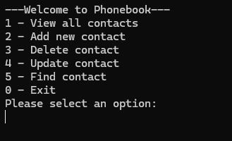
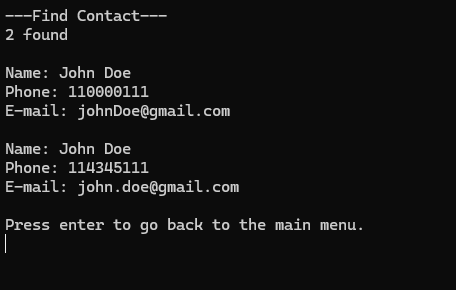
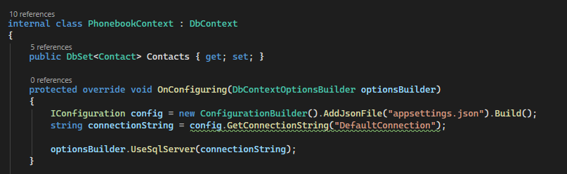
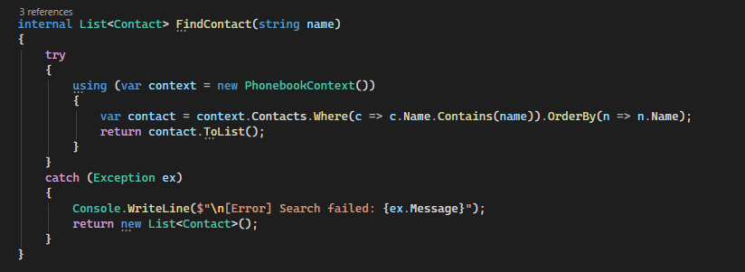
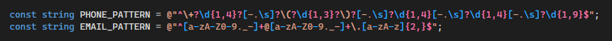

# Phonebook
Phonebook is the third olive green belt project from the C# Academy. The project introduces a popular ORM called Entity Framework onto the project. I programmed using C# with packages such as Entity Framework Core and SQL Server Management for the database with Visual Studio 2026. I also use Google Gemini to explain certain things or when I get stuck.

## Requirements
- Use Entity Framework. ADO.NET, Dapper and any other ORM aren't allowed.
- Code should contain a base Contact class with at least name, email and phone number properties.
- Validate e-mails and phone numbers and let the user know what formats are expected.
- Handle errors so the app doesn't crash unexpectedly in case EF or the database have problems.
- Seed data using Entity Framework so the user has some contacts to start with.

## Features
- Database using Entity Framework.

- CRUD functions:
    - Users insert their contact name, phone number and e-mail.
    - Users can view all contact and find contact by their name, 
    - Users can delete and update contact using a combination of Name and ID to prevent conflicts from duplicate names.
    - Phone number and E-mail are validated using Regex pattern.

## Challenges
- Learning about Entity Framework itself. This one is a bit different than other ORMS as you have to start coding the model, which are the entity (table) and then the database created. The setup is more elaborate than the other ORMs starting with making a Context class for configuration and a bridge between the project and the database, and create a migration through Package Manager Console to create the whole database. For CRUD operations, EF Core execute SQL commands for you, but instead of SQL, I have to learn LINQ commands to Read, Update and Delete.

DBContext class

An example of CRUD command using LINQ with EF Core.

- Learning about Regex Patterns. 
Regex patterns is something I've seen before but I never really understand what it does. It's basically a way for the computer to identify the pattern such as e-mails "@", domain suffixes for email and phone number sequences to be extracted from a string. 

## References
- https://www.entityframeworktutorial.net/efcore/entity-framework-core.aspx
- https://www.youtube.com/watch?v=SryQxUeChMc&list=PLdo4fOcmZ0oXCPdC3fTFA3Z79-eVH3K-s&index=1
- https://uibakery.io/regex-library/phone-number-csharp
- https://www.youtube.com/watch?v=V_DzcyGTXW0
- Google Gemini
